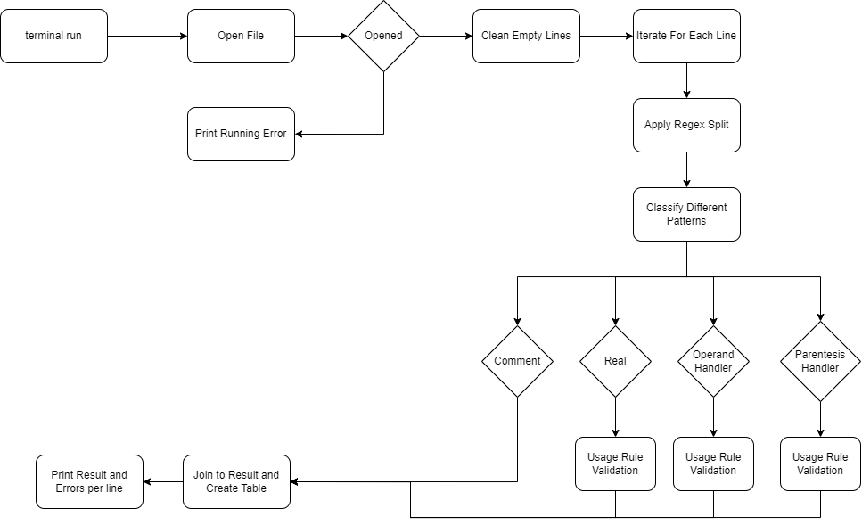

# Programando un nuevo LP


This program takes a file name and generates a table identifing it's tokens and types.
In Case their is any error of usage, it will show a list of errors at the end of each table.

# Diagram


## Installation
Install Python <https://www.geeksforgeeks.org/how-to-install-python-on-windows/> 

Install Pip <https://www.geeksforgeeks.org/how-to-install-pip-on-windows>

Install Tabulate

```bash
  pip install tabulate

```
    
## Code

```python
import re as regex
import sys
from tabulate import tabulate


#Define Patterns 
real_pat = r'[-]?[\.]?\d+[.]?\d*[(e|E)]?[-]?\d*'
var_pat = r'[A-Za-z][\w]*'
comment_pat= r'//.*'
operand_pat  = r'[=*+-/^@]'
parent_pat = '[()]'
compare_pat = "[@]"

def lexerAritmetico(file):
    #Open File to read
    with open(file, "r") as input_file:
        #Get Operation Lines
        for line in input_file.readlines():
            #Remove Empty Lines
            if line.strip():
                result = patternSplit(line)
                #print Tables
                print(tabulate(result[0],["Token", "Tipo"], tablefmt="grid"))
                #print Errors
                for error in result[1]:
                    if(error != ""):
                        print(error)
                
    
def patternSplit(line):
    result = [[],[]]
    

    #Parentesis and comparison Correction
    line = line.replace("(", " ( ")
    line = line.replace(")", " ) ")
    line = line.replace("==", "@")
    #Splitting Base on Pattern
    splitting = regex.findall(real_pat + "|" + var_pat + "|" + comment_pat + "|" + operand_pat + "|" + parent_pat + "|" + compare_pat,line)

    #Check valid pattern to apply rules
    for x in splitting:
        if regex.match(real_pat,x):
            if(regex.match('-?\d+(.?)[Ee]',x)):
                result[1].append("Error: Se espera un operador despues de un real o decimal")
            result[0].append([x, "Real"])
            
        elif regex.match(var_pat,x):
            result[0].append([x, "Variable"])
        elif regex.match(comment_pat,x):
            result[0].append([x,"Commentario"])
        elif regex.match(operand_pat,x):
            res = operandRuller(x, splitting)
            result[0].append(res[0])
            result[1].append(res[1])
        elif regex.match(parent_pat,x):
            res = parentesisHandler(x, splitting)
            result[0].append(res[0])
            result[1].append(res[1])
            
    return result
    

#Function to check parentesis completed
def parentesisHandler(value, line):
    result = []
    error  = ""
    if(value == '('):
        if ")" not in line:
            error = "Error: Falta Cierre de Parentesis"
        else: 
            if(line.index(value) < line.index(")")):
                error = "Error: El cierre de parentesis se encuentral es posicion incorrecta"

        result = [value, "Parentecis Abierto"]
    if(value == ')'):
        result = [value, "Parentecis Cerrado"]
    return [result, error]

def operandRuller(value, line): 
    result = []
    error = ""
    pos = line.index(value)
    if(regex.match(comment_pat, line[pos + 1]) or regex.match(operand_pat, line[pos + 1])):
        #Exclude some failed to detec regex
        if(regex.match(real_pat,line[pos + 1])):
            error = ""
        else:
            error = "Error: Falta valor valido despues del operador "

    #Check Operation Type
    match value:
        case "=":
            result = [value,"Igualacion"]
        case "*":
            result = [value,"Multiplicacion"]
        case "+":
            result = [value,"Sumatoria"]
        case "-":
            result = [value,"Resta"]
        case "/":
            result = [value,"Division"]
        case "^":
            result = [value,"Potencia"]
        case "@":
            result = ["==","Comparacion"]
    return [result, error]

if(len(sys.argv) == 2):
    if regex.match(r'.*\.txt',sys.argv[1]):
        lexerAritmetico(sys.argv[1])
    else:
        print("Error: File format is not correct, it should be txt format")
else:
    print("Error: Missing File Name    python main.py  filename.txt")

```


## Running 

``` 
[ferruiz@lab2.construtec.mx]# python main.py sample.txt

+---------+--------------------+
| Token   | Tipo               |
+=========+====================+
| d3      | Variable           |
+---------+--------------------+
| ==      | Comparacion        |
+---------+--------------------+
| 45      | Real               |
+---------+--------------------+
| (       | Parentecis Abierto |
+---------+--------------------+
| /       | Division           |
+---------+--------------------+
| 38      | Real               |
+---------+--------------------+
| )       | Parentecis Cerrado |
+---------+--------------------+
| ^       | Potencia           |
+---------+--------------------+
| 3       | Real               |
+---------+--------------------+
Error: El cierre de parentesis se encuentral es posicion incorrecta
+----------------------+-------------+
| Token                | Tipo        |
+======================+=============+
| //Ejemplos de prueba | Commentario |
+----------------------+-------------+
+---------+------------+
| Token   | Tipo       |
+=========+============+
| b       | Variable   |
+---------+------------+
| =       | Igualacion |
+---------+------------+
| 7       | Real       |
+---------+------------+
+---------+--------------------+
| Token   | Tipo               |
+=========+====================+
| a       | Variable           |
+---------+--------------------+
| =       | Igualacion         |
+---------+--------------------+
| 32.4    | Real               |
+---------+--------------------+
| *       | Multiplicacion     |
+---------+--------------------+
| (       | Parentecis Abierto |
+---------+--------------------+
| -8.6    | Real               |
+---------+--------------------+
| -       | Resta              |
+---------+--------------------+
| b       | Variable           |
+---------+--------------------+
| )       | Parentecis Cerrado |
+---------+--------------------+
| /       | Division           |
+---------+--------------------+
| 6.1E-8  | Real               |
+---------+--------------------+
Error: El cierre de parentesis se encuentral es posicion incorrecta
+--------------------------+-------------+
| Token                    | Tipo        |
+==========================+=============+
| d                        | Variable    |
+--------------------------+-------------+
| =                        | Igualacion  |
+--------------------------+-------------+
| a                        | Variable    |
+--------------------------+-------------+
| ^                        | Potencia    |
+--------------------------+-------------+
| b                        | Variable    |
+--------------------------+-------------+
| // Esto es un comentario | Commentario |
+--------------------------+-------------+
+---------+------------+
| Token   | Tipo       |
+=========+============+
| c       | Variable   |
+---------+------------+
| =       | Igualacion |
+---------+------------+
| 6.5     | Real       |
+---------+------------+
| .3      | Real       |
+---------+------------+
+---------+------------+
| Token   | Tipo       |
+=========+============+
| d1      | Variable   |
+---------+------------+
| =       | Igualacion |
+---------+------------+
| 16      | Real       |
+---------+------------+
| b       | Variable   |
+---------+------------+
+---------+------------+
| Token   | Tipo       |
+=========+============+
| dato0   | Variable   |
+---------+------------+
| =       | Igualacion |
+---------+------------+
| 3       | Real       |
+---------+------------+
| -       | Resta      |
+---------+------------+
| -5      | Real       |
+---------+------------+
+---------+------------+
| Token   | Tipo       |
+=========+============+
| dato1   | Variable   |
+---------+------------+
| =       | Igualacion |
+---------+------------+
| 3       | Real       |
+---------+------------+
+---------+------------+
| Token   | Tipo       |
+=========+============+
| -       | Resta      |
+---------+------------+
| b       | Variable   |
+---------+------------+
| =       | Igualacion |
+---------+------------+
| 8       | Real       |
+---------+------------+
+---------+-------------+
| Token   | Tipo        |
+=========+=============+
| g       | Variable    |
+---------+-------------+
| =       | Igualacion  |
+---------+-------------+
| //      | Commentario |
+---------+-------------+
Error: Falta valor valido despues del operador
+---------+------------+
| Token   | Tipo       |
+=========+============+
| h       | Variable   |
+---------+------------+
| =       | Igualacion |
+---------+------------+
| 8.-3    | Real       |
+---------+------------+
+---------+------------+
| Token   | Tipo       |
+=========+============+
| d2      | Variable   |
+---------+------------+
| =       | Igualacion |
+---------+------------+
| -3e-4   | Real       |
+---------+------------+
| f       | Variable   |
+---------+------------+
Error: Se espera un operador despues de un real o decimal
+---------+--------------------+
| Token   | Tipo               |
+=========+====================+
| d3      | Variable           |
+---------+--------------------+
| ==      | Comparacion        |
+---------+--------------------+
| 45      | Real               |
+---------+--------------------+
| (       | Parentecis Abierto |
+---------+--------------------+
| /       | Division           |
+---------+--------------------+
| 38      | Real               |
+---------+--------------------+
| )       | Parentecis Cerrado |
+---------+--------------------+
| ^       | Potencia           |
+---------+--------------------+
| 3       | Real               |
+---------+--------------------+
Error: El cierre de parentesis se encuentral es posicion incorrecta
+---------+--------------------+
| Token   | Tipo               |
+=========+====================+
| d4      | Variable           |
+---------+--------------------+
| =       | Igualacion         |
+---------+--------------------+
| 45      | Real               |
+---------+--------------------+
| (       | Parentecis Abierto |
+---------+--------------------+
| *       | Multiplicacion     |
+---------+--------------------+
| 38      | Real               |
+---------+--------------------+
| )       | Parentecis Cerrado |
+---------+--------------------+
| ^       | Potencia           |
+---------+--------------------+
| 3       | Real               |
+---------+--------------------+
Error: El cierre de parentesis se encuentral es posicion incorrecta
+---------+------------+
| Token   | Tipo       |
+=========+============+
| d5___3  | Variable   |
+---------+------------+
| =       | Igualacion |
+---------+------------+
| 6E-8    | Real       |
+---------+------------+
Error: Se espera un operador despues de un real o decimal
+---------+------------+
| Token   | Tipo       |
+=========+============+
| d6      | Variable   |
+---------+------------+
| =       | Igualacion |
+---------+------------+
| 6.E-8   | Real       |
+---------+------------+
Error: Se espera un operador despues de un real o decimal
PS C:\Users\ferna\Downloads\Actividad> python main.py
+---------+--------------------+
| Token   | Tipo               |
+=========+====================+
| d3      | Variable           |
+---------+--------------------+
| ==      | Comparacion        |
+---------+--------------------+
| 45      | Real               |
+---------+--------------------+
| (       | Parentecis Abierto |
+---------+--------------------+
| /       | Division           |
+---------+--------------------+
| 38      | Real               |
+---------+--------------------+
| )       | Parentecis Cerrado |
+---------+--------------------+
| ^       | Potencia           |
+---------+--------------------+
| 3       | Real               |
+---------+--------------------+
Error: El cierre de parentesis se encuentral es posicion incorrecta
+----------------------+-------------+
| Token                | Tipo        |
+======================+=============+
| //Ejemplos de prueba | Commentario |
+----------------------+-------------+
+---------+------------+
| Token   | Tipo       |
+=========+============+
| b       | Variable   |
+---------+------------+
| =       | Igualacion |
+---------+------------+
| 7       | Real       |
+---------+------------+
+---------+--------------------+
| Token   | Tipo               |
+=========+====================+
| a       | Variable           |
+---------+--------------------+
| =       | Igualacion         |
+---------+--------------------+
| 32.4    | Real               |
+---------+--------------------+
| *       | Multiplicacion     |
+---------+--------------------+
| (       | Parentecis Abierto |
+---------+--------------------+
| -8.6    | Real               |
+---------+--------------------+
| -       | Resta              |
+---------+--------------------+
| b       | Variable           |
+---------+--------------------+
| )       | Parentecis Cerrado |
+---------+--------------------+
| /       | Division           |
+---------+--------------------+
| 6.1E-8  | Real               |
+---------+--------------------+
Error: El cierre de parentesis se encuentral es posicion incorrecta
+--------------------------+-------------+
| Token                    | Tipo        |
+==========================+=============+
| d                        | Variable    |
+--------------------------+-------------+
| =                        | Igualacion  |
+--------------------------+-------------+
| a                        | Variable    |
+--------------------------+-------------+
| ^                        | Potencia    |
+--------------------------+-------------+
| b                        | Variable    |
+--------------------------+-------------+
| // Esto es un comentario | Commentario |
+--------------------------+-------------+
+---------+------------+
| Token   | Tipo       |
+=========+============+
| c       | Variable   |
+---------+------------+
| =       | Igualacion |
+---------+------------+
| 6.5     | Real       |
+---------+------------+
| .3      | Real       |
+---------+------------+
+---------+------------+
| Token   | Tipo       |
+=========+============+
| d1      | Variable   |
+---------+------------+
| =       | Igualacion |
+---------+------------+
| 16      | Real       |
+---------+------------+
| b       | Variable   |
+---------+------------+
+---------+------------+
| Token   | Tipo       |
+=========+============+
| dato0   | Variable   |
+---------+------------+
| =       | Igualacion |
+---------+------------+
| 3       | Real       |
+---------+------------+
| -       | Resta      |
+---------+------------+
| -5      | Real       |
+---------+------------+
+---------+------------+
| Token   | Tipo       |
+=========+============+
| dato1   | Variable   |
+---------+------------+
| =       | Igualacion |
+---------+------------+
| 3       | Real       |
+---------+------------+
+---------+------------+
| Token   | Tipo       |
+=========+============+
| -       | Resta      |
+---------+------------+
| b       | Variable   |
+---------+------------+
| =       | Igualacion |
+---------+------------+
| 8       | Real       |
+---------+------------+
+---------+-------------+
| Token   | Tipo        |
+=========+=============+
| g       | Variable    |
+---------+-------------+
| =       | Igualacion  |
+---------+-------------+
| //      | Commentario |
+---------+-------------+
Error: Falta valor valido despues del operador
+---------+------------+
| Token   | Tipo       |
+=========+============+
| h       | Variable   |
+---------+------------+
| =       | Igualacion |
+---------+------------+
| 8.-3    | Real       |
+---------+------------+
+---------+------------+
| Token   | Tipo       |
+=========+============+
| d2      | Variable   |
+---------+------------+
| =       | Igualacion |
+---------+------------+
| -3e-4   | Real       |
+---------+------------+
| f       | Variable   |
+---------+------------+
Error: Se espera un operador despues de un real o decimal
+---------+--------------------+
| Token   | Tipo               |
+=========+====================+
| d3      | Variable           |
+---------+--------------------+
| ==      | Comparacion        |
+---------+--------------------+
| )       | Parentecis Cerrado |
+---------+--------------------+
| 45      | Real               |
+---------+--------------------+
| (       | Parentecis Abierto |
+---------+--------------------+
| /       | Division           |
+---------+--------------------+
| 38      | Real               |
+---------+--------------------+
| )       | Parentecis Cerrado |
+---------+--------------------+
| ^       | Potencia           |
+---------+--------------------+
| 3       | Real               |
+---------+--------------------+
+---------+--------------------+
| Token   | Tipo               |
+=========+====================+
| d4      | Variable           |
+---------+--------------------+
| =       | Igualacion         |
+---------+--------------------+
| 45      | Real               |
+---------+--------------------+
| (       | Parentecis Abierto |
+---------+--------------------+
| *       | Multiplicacion     |
+---------+--------------------+
| 38      | Real               |
+---------+--------------------+
| )       | Parentecis Cerrado |
+---------+--------------------+
| ^       | Potencia           |
+---------+--------------------+
| 3       | Real               |
+---------+--------------------+
Error: El cierre de parentesis se encuentral es posicion incorrecta
+---------+------------+
| Token   | Tipo       |
+=========+============+
| d5___3  | Variable   |
+---------+------------+
| =       | Igualacion |
+---------+------------+
| 6E-8    | Real       |
+---------+------------+
Error: Se espera un operador despues de un real o decimal
+---------+------------+
| Token   | Tipo       |
+=========+============+
| d6      | Variable   |
+---------+------------+
| =       | Igualacion |
+---------+------------+
| 6.E-8   | Real       |
+---------+------------+
Error: Se espera un operador despues de un real o decimal
```


## Normal Running Errors
Missing Python Module (Refer to install part)
```
[ferruiz@lab2.construtec.mx]# python main.py sample.txt
File "/home/ferruiz/act/main.py", line 3, in <module>
    from tabulate import tabulate
ModuleNotFoundError: No module named 'tabulate'
```

Missing File name on running
```bash
[ferruiz@lab2.construtec.mx]# python main.py
Error: Missing File Name    python main.py  filename.txt
```

Wrong sample file format (It should be txt file format)
```bash
[ferruiz@lab2.construtec.mx]# python main.py sample.txt
Error: File format is not correct, it should be txt format
```
File Not Founded or not being able to open it
```
[ferruiz@lab2.construtec.mx]# python main.py sample2.txt
Not able to find the file or to open it
```


## Authors

- [@fernandoRuiz](https://github.com/TheMindBreaker)

